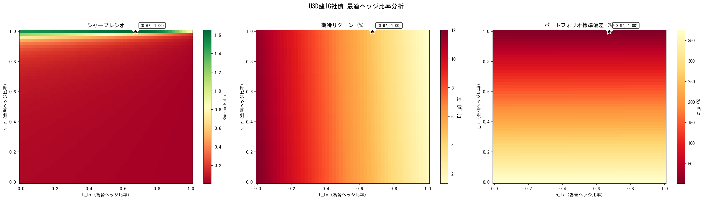
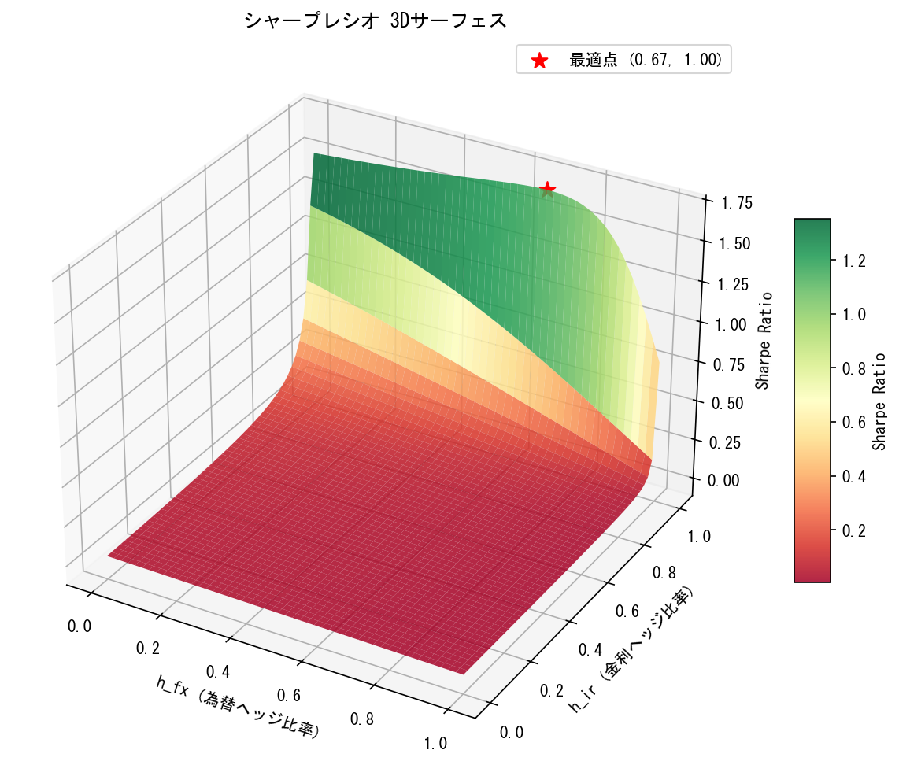
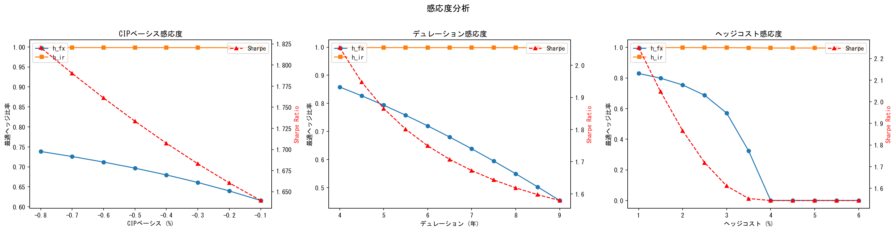

# USD建社債投資 最適ヘッジ比率分析ツール

本邦投資家がUSD建IG社債インデックスに円建てで投資する際の、為替ヘッジ比率（h_fx）と金利ヘッジ比率（h_ir）を最適化し、シャープレシオを最大化するポートフォリオ分析ツール。

---

## リターンモデル

### 円建てリターン（実現値）

```
r_p = I_spread / 100
    + (1 - h_ir) * Swap_rate          未ヘッジ分: 固定金利キャリー
    + h_ir * SOFR                      ヘッジ済分: スワップで変動金利を受取
    + (1 - h_fx) * Δ(USDJPY)          未ヘッジ為替変動
    - h_fx * FX_hedge_cost             為替ヘッジコスト
    - (1 - h_ir) * D * ΔR_USD         金利変動による価格変化
    - D_spread * ΔI_spread / 100       スプレッド変動による価格変化
```

### 期待リターン（年率）

```
E[r_p] = I_spread / 100
       + (1 - h_ir) * Swap_rate
       + h_ir * SOFR
       + (1 - h_fx) * E[Δ(USDJPY)]
       - h_fx * FX_hedge_cost
```

- `E[ΔR_USD] = 0`, `E[ΔI_spread] = 0` と仮定（マーチンゲール）
- `E[Δ(USDJPY)]` はデフォルトで過去データのサンプル平均を使用。`config.py` で上書き可能

### 直感的な理解

| シナリオ | 期待リターン |
|---|---|
| フルヘッジ (h_fx=1, h_ir=1) | I_spread + SOFR - FXヘッジコスト |
| ノーヘッジ (h_fx=0, h_ir=0) | I_spread + Swap_rate + E[Δ(USDJPY)] |
| FXのみヘッジ (h_fx=1, h_ir=0) | I_spread + Swap_rate - FXヘッジコスト |
| 金利のみヘッジ (h_fx=0, h_ir=1) | I_spread + SOFR + E[Δ(USDJPY)] |

### ポートフォリオ分散

```
σ²_p = w' * Σ * w

w = [-(1 - h_ir) * D,  (1 - h_fx),  -D_spread / 100]
Σ = 3×3 共分散行列 [ΔR_USD, Δ(USDJPY), ΔI_spread]
```

- `ΔR_USD`: %ポイント単位
- `Δ(USDJPY)`: 対数リターン
- `ΔI_spread`: bp単位（ウェイト側で /100 して%に変換）
- スプレッド拡大は価格下落なので符号はマイナス

---

## ディレクトリ構成

```
corporatebond_hedge_strategy/
├── README.md
├── .gitignore
├── .env                               FRED APIキー（git管理外）
├── heatmaps.png                       ヒートマップ出力
├── surface_3d.png                     3Dサーフェス出力
├── sensitivity.png                    感応度分析出力
└── hedge_optimizer/
    ├── config.py                      パラメータ設定
    ├── main.py                        エントリーポイント（バッチ分析）
    ├── app.py                         Streamlitダッシュボード
    ├── scenario_fx.py                 ドル円シナリオ分析
    ├── stress_fx.py                   為替ストレステスト
    ├── requirements.txt               依存ライブラリ
    ├── data/
    │   └── fetch_data.py              FREDデータ取得・前処理
    ├── analysis/
    │   ├── covariance.py              共分散行列推定（ローリング / EWMA）
    │   ├── returns.py                 リターンモデル（期待リターン・分散・SR）
    │   └── optimizer.py               最適化（Grid Search + SciPy）・感応度分析
    └── visualization/
        └── plots.py                   ヒートマップ・3Dサーフェス・感応度プロット
```

---

## セットアップ

### 1. 依存ライブラリのインストール

```bash
pip install -r hedge_optimizer/requirements.txt
```

### 2. FRED APIキーの設定

[FRED API Keys](https://fred.stlouisfed.org/docs/api/api_key.html) でキーを取得し、`.env` ファイルに記載する。

```
FRED_API_KEY=your_api_key_here
```

### 3. 実行

```bash
# バッチ分析（最適化 + プロット生成）
python -m hedge_optimizer.main

# ドル円シナリオ分析
python -m hedge_optimizer.scenario_fx

# 為替ストレステスト
python -m hedge_optimizer.stress_fx

# インタラクティブダッシュボード（Streamlit）
streamlit run hedge_optimizer/app.py
```

---

## インタラクティブダッシュボード

Streamlitベースのインタラクティブツール。スライドバーとテキスト入力でリアルタイムにシミュレーションできる。

```bash
streamlit run hedge_optimizer/app.py
```

### 操作方法

| 操作 | 内容 |
|---|---|
| **h_fx スライダー** | 為替ヘッジ比率（0〜100%）をドラッグで変更 |
| **h_ir スライダー** | 金利ヘッジ比率（0〜100%）をドラッグで変更 |
| **ドル円変動 (%)** | 例: -5 → 5%円高シナリオ |
| **米金利変化 (%pt)** | 例: +0.5 → 50bp金利上昇 |
| **I_spread変化 (bp)** | 例: +50 → スプレッド50bp拡大 |

スライダーや入力値を動かすとトータルリターン・シャープレシオ・リターン分解がリアルタイムで更新される。下部に為替ストレステスト表も常時表示される。

### Streamlit Cloud へのデプロイ

1. [share.streamlit.io](https://share.streamlit.io) にGitHubアカウントでサインイン
2. **New app** → Repository: `HiroakiNakano1985/corporatebond_hedge_strategy` / Branch: `main` / Main file path: `hedge_optimizer/app.py`
3. **Advanced settings → Secrets** に `FRED_API_KEY = "your_key"` を設定
4. **Deploy**

---

## データソース

### FREDから取得する系列（自動）

| 変数 | FREDコード | 頻度 | 開始時期 |
|---|---|---|---|
| ICE BofA IG社債 OAS | `BAMLC0A0CM` | 日次 | 1996年12月 |
| 米10年国債利回り | `DGS10` | 日次 | 1962年 |
| SOFR翌日物 | `SOFR` | 日次 | 2018年4月 |
| SOFR 90日平均 | `SOFR90DAYAVG` | 日次 | 2020年3月 |
| ドル円 | `DEXJPUS` | 日次 | 1971年 |
| 日本コールレート | `IRSTCI01JPM156N` | 月次 | 1998年頃 |

**データ期間の制約**: SOFR90DAYAVGが2020年3月開始のため、最大約6年分（2026年4月現在）。

### 前処理

- 週次リサンプル（金曜日基準）
- 月次データ（日本コールレート）は日次に線形補間後、週次化
- 欠損値は前値補完（ffill）
- 週次変化量は対数リターン（ドル円）または差分（金利・スプレッド）

---

## 定数近似と実務利用時の修正箇所

本ツールはFREDの無料データのみで動作するよう設計されている。
実務で精緻な分析を行う場合、以下の定数近似を実データに置き換える必要がある。

### 優先度: 高（リターン計算への影響が大きい）

| 項目 | 現在の実装 | 実務での対応 | 該当箇所 |
|---|---|---|---|
| **スワップスプレッド** | `-20bp` 固定 | Bloomberg等からUSD IRS 10Y - UST 10Y の時系列を取得 | `config.py: SWAP_SPREAD_APPROX_BP` |
| **CIPベーシス** | `-0.4%` 固定 | 為替フォワード/ベーシススワップから逆算した時系列 | `config.py: CIP_BASIS` |
| **スワップレート** | `UST10Y + スワップスプレッド` で近似 | 実際のUSD IRS 10Yレートの時系列 | `fetch_data.py: compute_derived_fields()` |

**影響**: スワップスプレッドは近年-30bp〜+10bpまで変動しており、定数近似はI_spread計算と期待リターンの両方に誤差を生じさせる。CIPベーシスも市場環境により-0.1%〜-0.8%程度変動する。

### 優先度: 中（ポートフォリオ固有のパラメータ）

| 項目 | 現在の実装 | 実務での対応 | 該当箇所 |
|---|---|---|---|
| **修正デュレーション** | `6.5年` 固定 | 投資対象インデックスまたはポートフォリオの実際のD | `config.py: DURATION` |
| **スプレッドデュレーション** | `= D` と仮定 | OAD（Option-Adjusted Duration）を別途取得 | `config.py: DURATION_SPREAD` |
| **日本短期金利** | OECDコールレート（月次） | TONA（日銀公表、日次） | `config.py: FRED_SERIES["japan_call"]` |

**影響**: デュレーションはリスク計算に直結。月次コールレートは金利急変時に週次補間でラグが生じる。

### 優先度: 低（現状のままで概ね問題ない）

| 項目 | 理由 |
|---|---|
| OAS (BAMLC0A0CM) | FREDの実データ。ICE BofA指数に基づく市場標準 |
| UST 10Y (DGS10) | FREDの実データ |
| SOFR / SOFR 90D | FREDの実データ |
| USDJPY (DEXJPUS) | FREDの実データ。Bloombergとの乖離は軽微 |

### 実データに差し替える場合の実装方針

定数近似を時系列に置き換える場合、`fetch_data.py` の `compute_derived_fields()` を修正する。

```python
# 現在（定数近似）
df["swap_rate"] = df["ust_10y"] + SWAP_SPREAD_APPROX_BP / 100.0
df["i_spread"] = df["oas"] - SWAP_SPREAD_APPROX_BP
df["hedge_cost"] = df["sofr_90d"] - df["japan_call"] + CIP_BASIS * 100

# 実データ版（例）
df["swap_rate"] = df["irs_10y"]                          # 外部データ
df["i_spread"] = df["oas"] - (df["irs_10y"] - df["ust_10y"]) * 100
df["hedge_cost"] = df["sofr_90d"] - df["tona"] + df["cip_basis"]
```

Bloomberg/Refinitivからのデータ取得関数を `fetch_data.py` に追加し、`config.py` でデータソースを切り替える設計を推奨する。

---

## パラメータ一覧（config.py）

| パラメータ | デフォルト値 | 説明 |
|---|---|---|
| `DURATION` | `6.5` | 修正デュレーション（年） |
| `DURATION_SPREAD` | `6.5` | スプレッドデュレーション（年） |
| `CIP_BASIS` | `-0.004` | CIPベーシス（-0.4%） |
| `RISK_FREE_RATE` | `0.0` | シャープレシオ計算用リスクフリーレート（%） |
| `E_FX_RETURN_OVERRIDE` | `None` | ドル円期待変動の上書き値（年率%）。`None`=過去データ平均 |
| `WINDOW_WEEKS` | `52` | ローリング共分散のウィンドウ幅（週） |
| `EWMA_LAMBDA` | `0.94` | EWMA共分散の減衰係数 |
| `H_GRID_SIZE` | `50` | Grid Searchの分割数（h_fx, h_ir 各軸） |
| `DATA_YEARS` | `5` | FREDから取得するデータ期間（年） |
| `SWAP_SPREAD_APPROX_BP` | `-20` | スワップスプレッド近似値（bp） |

---

## 最適化手法

### Grid Search

- h_fx: 0〜1 を50分割、h_ir: 0〜1 を50分割（計2,500点）
- 各点でシャープレシオを計算し、最大点を探索

### SciPy精緻化

- Grid Searchの最適点を初期値として、L-BFGS-B法で連続最適化
- 制約: `0 <= h_fx <= 1`, `0 <= h_ir <= 1`

---

## 共分散行列の推定方法

### ローリングウィンドウ（デフォルト）

- 直近52週（1年）の週次変化量からサンプル共分散を計算
- 全期間で均等に重み付け

### EWMA（Exponentially Weighted Moving Average）

- `S_t = λ * S_{t-1} + (1-λ) * r_t * r_t'`
- `λ = 0.94`（RiskMetrics標準）
- 直近のデータほど重く、レジームチェンジへの追従が早い

---

## 出力

### コンソール出力

```
最適ヘッジ比率 (SciPy):
  為替ヘッジ比率 (h_fx): 0.68
  金利ヘッジ比率 (h_ir): 1.00
  最大シャープレシオ:     1.707
  期待リターン:           4.61%
  ポートフォリオ標準偏差: 2.70%
```

### プロット（PNG保存 + 画面表示）

| ファイル名 | 内容 |
|---|---|
| `heatmaps.png` | シャープレシオ / 期待リターン / 標準偏差の2Dヒートマップ（最適点を★でマーク） |
| `surface_3d.png` | シャープレシオの3Dサーフェスプロット |
| `sensitivity.png` | CIPベーシス / デュレーション / ヘッジコストの感応度分析 |

---

## 分析結果（2026年4月実行時点）

以下は2021年4月〜2026年4月の過去5年分のFREDデータに基づく分析結果である。

### 使用した市場データ（最新週）

| 項目 | 値 |
|---|---|
| I_spread | 21 bp |
| スワップレート（近似） | 4.14% |
| SOFR 90日平均 | 3.67% |
| 日本コールレート | 0.73% |
| ドル円 | 159.64 |
| FXヘッジコスト | 2.54%（年率） |
| E[Δ(USDJPY)]（過去平均） | +7.67%（年率） |

### 最適ヘッジ比率

過去5年のデータから推定した共分散行列（52週ローリング）とサンプル平均を用いて、
シャープレシオを最大化するヘッジ比率を探索した結果:

| 項目 | Grid Search | SciPy精緻化 |
|---|---|---|
| 為替ヘッジ比率 (h_fx) | 0.67 | **0.68** |
| 金利ヘッジ比率 (h_ir) | 1.00 | **1.00** |
| 最大シャープレシオ | 1.656 | **1.707** |
| 期待リターン | 4.67% | **4.61%** |
| ポートフォリオ標準偏差 | 2.82% | **2.70%** |

**解釈**:
- **金利リスクはフルヘッジが最適**（h_ir=1.00）。米金利のボラティリティが大きく（年率0.58%pt）、ヘッジしないリスクがキャリーに見合わない
- **為替は約7割ヘッジが最適**（h_fx=0.68）。過去5年の円安トレンド（+7.67%/年）があるため、32%をオープンにすることでリターンを上乗せしている
- フルヘッジ（h_fx=1, h_ir=1）だとリターン1.34%に対し、最適比率では4.61%まで改善される

### ヒートマップ

h_fx（為替ヘッジ比率）と h_ir（金利ヘッジ比率）の全組み合わせについて、
シャープレシオ・期待リターン・ポートフォリオ標準偏差を計算した結果。
最適点を★でマークしている。



- **左図（シャープレシオ）**: h_ir=1.0 付近、h_fx=0.65〜0.70 付近にピークがある。金利ヘッジを外すとシャープレシオが急速に悪化する
- **中図（期待リターン）**: h_fx が小さいほど（為替オープンが大きいほど）期待リターンは高い。ただしリスクも増加する
- **右図（標準偏差）**: h_fx=1, h_ir=1（右上隅）でリスクが最小。為替・金利をオープンにするほどリスクが増加する

### 3Dサーフェスプロット

シャープレシオの全曲面を立体的に可視化したもの。



h_ir 方向（金利ヘッジ）に急勾配があり、金利ヘッジの効果がシャープレシオに大きく影響していることが視覚的にわかる。

### 感応度分析

CIPベーシス・デュレーション・ヘッジコスト水準を変化させた場合の最適点の移動を分析。



| パラメータ | 変化範囲 | 結果の傾向 |
|---|---|---|
| CIPベーシス | -0.1% 〜 -0.8% | ベーシスが深くなる（コスト低下）ほど h_fx が上昇（0.62→0.74）。ヘッジコストが安くなるため為替ヘッジを増やす方向 |
| デュレーション | 4年 〜 9年 | 短デュレーションほど h_fx が高い（0.86→0.45）。金利リスクが小さい分、為替ヘッジに注力できる |
| FXヘッジコスト | 1% 〜 6% | 全範囲で h_ir=1.00。コストが高いほど h_fx は低下 |

---

## ドル円シナリオ分析

E[Δ(USDJPY)] の前提を変えた場合に、最適ヘッジ比率がどう変わるかを分析する。

```bash
python -m hedge_optimizer.scenario_fx
```

### 結果

| シナリオ | E[USDJPY] | h_fx (為替) | h_ir (金利) | Sharpe | E[r_p] | σ_p |
|---|---|---|---|---|---|---|
| 過去平均 | +7.67% | 0.68 | 1.00 | 1.71 | +4.61% | 2.70% |
| ランダムウォーク | 0.00% | 0.87 | 1.00 | 0.93 | +1.66% | 1.79% |
| 円高 -3%/年 | -3.00% | 0.97 | 1.00 | 0.79 | +1.33% | 1.67% |
| 円高 -5%/年 | -5.00% | 1.00 | 1.00 | 0.79 | +1.34% | 1.70% |
| 円高 -10%/年 | -10.00% | 1.00 | 1.00 | 0.79 | +1.34% | 1.70% |

**解釈**:
- **金利はどのシナリオでもフルヘッジ**（h_ir=1.00）が最適
- 為替見通しが円高方向に傾くほど h_fx が上昇し、-5%以下では**フルヘッジに張り付く**
- ランダムウォーク（E[Δ(USDJPY)]=0）でも h_fx=0.87 → ヘッジコスト2.54%を払ってでも為替ボラを削減する価値がある
- 円高局面ではリターン源泉が I_spread + SOFR - FXコスト = 約1.3% に限定される

---

## 為替ストレステスト

最適ヘッジ比率（h_fx=0.68, h_ir=1.00）を**固定**したまま、
ドル円が実際に様々な幅で変動した場合のポートフォリオリターンへの影響を計算する。

```bash
python -m hedge_optimizer.stress_fx
```

### リターン構成（為替変動以外の確定部分）

最適比率 h_fx=0.68, h_ir=1.00 の場合、為替を除いた確定キャリーは以下の通り:

| 項目 | 値 | 計算 |
|---|---|---|
| I_spread | +0.21% | 21bp / 100 |
| SOFR受取（IRヘッジ） | +3.66% | 1.00 × 3.67% |
| 固定金利キャリー | +0.01% | (1-1.00) × 4.14% |
| FXヘッジコスト | -1.73% | 0.68 × 2.54% |
| **確定分 合計** | **+2.15%** | |
| 為替エクスポージャー | 0.32 | 1 - 0.68 |

トータルリターン = 確定分 2.15% + 0.32 × Δ(USDJPY)

### ストレス結果

| Δ(USDJPY) | 為替寄与 | トータル r_p | Sharpe | 備考 |
|---|---|---|---|---|
| +10.0%（円安） | +3.20% | **+5.35%** | 1.98 | |
| +5.0% | +1.60% | **+3.75%** | 1.39 | |
| +3.0% | +0.96% | **+3.11%** | 1.15 | |
| 0.0%（横ばい） | 0.00% | **+2.15%** | 0.80 | |
| -3.0%（円高） | -0.96% | **+1.19%** | 0.44 | フルヘッジ(1.34%)を下回る |
| -5.0% | -1.60% | **+0.55%** | 0.20 | |
| -10.0% | -3.20% | **-1.05%** | -0.39 | **リターンがマイナスに転落** |
| -15.0% | -4.80% | **-2.65%** | -0.98 | |
| -20.0% | -6.40% | **-4.25%** | -1.58 | |

### 参考: フルヘッジ（h_fx=1.00）の場合

| 項目 | 値 |
|---|---|
| リターン | +1.34% |
| 標準偏差 | 1.75% |
| Sharpe | 0.76 |

為替変動の影響を一切受けない。

### 損益分岐点

**Δ(USDJPY) = -2.5%**

- ドル円が年率 -2.5% 以上の円高になると、最適比率（h_fx=0.68）よりフルヘッジ（h_fx=1.00）の方がリターンで有利になる
- 逆に -2.5% 未満の円高（横ばいや円安）であれば、32%の為替オープンが奏功する
- 過去5年の実績（+7.67%/年の円安）が今後も続く前提なら最適比率が合理的だが、円高転換リスクを重視するならフルヘッジの方が保守的な選択となる

---

## 注意事項・前提

- 本ツールは過去データに基づく事後的な分析であり、将来のリターンを予測するものではない
- FREDのデータは米国営業日ベースであり、日本の祝日との不整合がある
- OAS（BAMLC0A0CM）は対国債スプレッド。I_spreadへの変換にはスワップスプレッドの推定が必要
- 為替ヘッジはロールオーバーコストや取引コストを含まない理論値
- 金利ヘッジはpar swapベースであり、KRDによるバケット別ヘッジは未実装（オプション対応予定）
- 信用リスクのデフォルト損失は考慮していない（スプレッドリスクのみモデル化）
